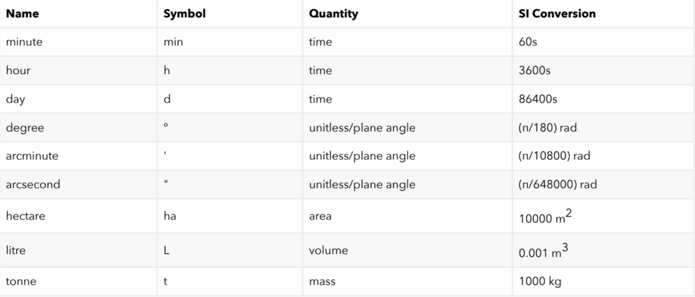

# Convert-Units   

https://convert-units.herokuapp.com/units/si

<a href="https://convert-units.herokuapp.com/units/si" target="_blank">https://convert-units.herokuapp.com/units/si</a>

Get API to convert widely used units to SI units with a multiplication factor for conversion

---

## Dependencies
Node.js and Express

---

## How to Use
Add query parameter to url after si, as ?units=tonne, where tonne is the query parameter.  
For example: <a href="https://convert-units.herokuapp.com/units/si?units=(degree/minute)" target="_blank">https://convert-units.herokuapp.com/units/si?units=(degree/minute)</a>

---

## Supported Units

---

## Authors
Navneeth Babra

